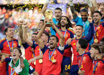

# Mi presentación:

Bienvenido a mi presentación,soy Lucas Mayor Gamenti, un alumno del centro [IES Angel Sanz Briz](https://www.iesangelsanzbriz.net/) de Casetas. Aquí encontraras toda mi información; como que me gusta, aficiones, logros, viajes, idiomas que hablo, etc.

# **Mis aficiones**:

Entre mis aficiones están, ver partidos de Fútbol, jugar a varios videojuegos con mi portatil, salir con mis amigos de fiesta o hacer quedadas con ellos en casas para pasar el rato juntos jugando y viendo películas, me encanta hacer natación e ir a entrenar al gimnasio con mi amiga y tambien me encanta viajar a diferentes países para conocer nuevas personas, culturas y gastronomías.

# **Mis logros**:

Llegue a representar mi anterior centro educativo [IES Conde Aranda](https://iescondearanda.wixsite.com/iescondearanda) hasta 3 veces; la primera fue en un concurso de programación por bloques con CODE en 3º de la ESO; la segunda fue en 4º de la ESO en una [Jornada Científica sobre el Desarollo Sostenible](https://www.iesangelsanzbriz.net/novedades#h.4cdbbpvvq9s5) que se hizo en Casetas, donde presente un discurso sobre los plásticos y los bioplásticos; y la última fue también en 4º de la ESO, donde fui a la Universidad de Ciencias de Zaragoza, a un concurso de cristalización donde tuve que presentar experimentos realizados antes en clase sobre cristalización con elementos químicos como el ADP (Dihidrógeno fosfato de Amonio)

# **Mis viajes**:

Al tener doble nacionalidad (Rumana y Española) viajo todos los años a ver a mi familia Rumana, a parte de eso, tengo también familia en más países siendo los siguientes:

- Alemania (Europa)
- Italia (Europa)
- Noruega (Europa)
- Angola (África)

Hay veces que también logró ir a Francia, Italia, Alemania, Hungría y Bulgaria. En los próximos años tengo pensado ir a Reino Unido, Suiza, Noruega y Japón.

# **Idiomas**

Desde pequeño aprendí el Español, aunque mi madre y abuela me hablaban en rumano para poder aprenderlo. En primaria aprendí el Inglés, mi tercera lengua, la cual me fue muy fácil de aprender. Cuando estaba en la ESO aprendí el Alemán un poco, ya que comencé a viajar mucho allí por mi familia. Actualmente me he puesto la idea de seguir aprendiendo Alemán y comenzar con el Japonés.
